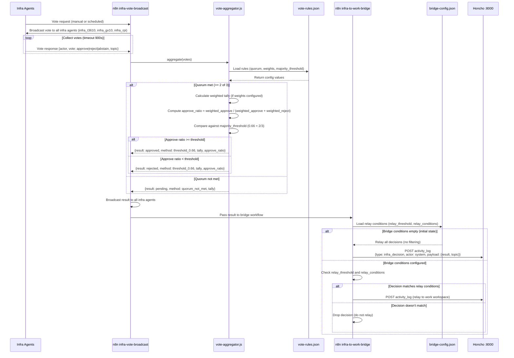
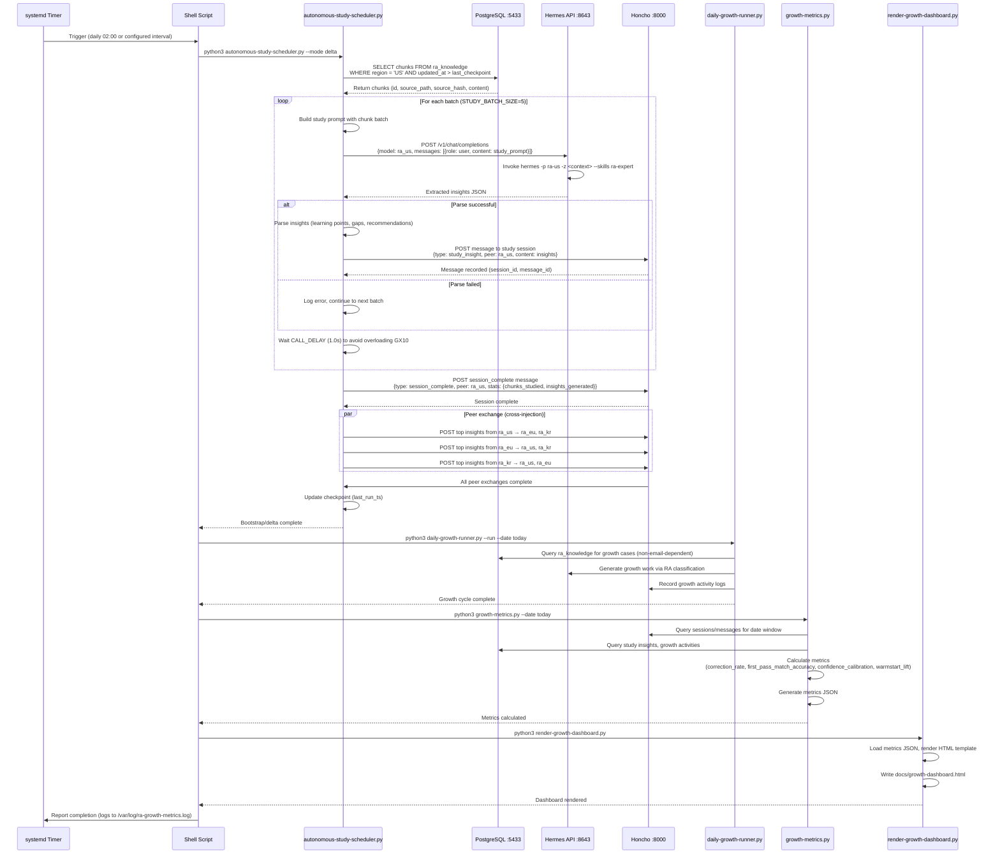
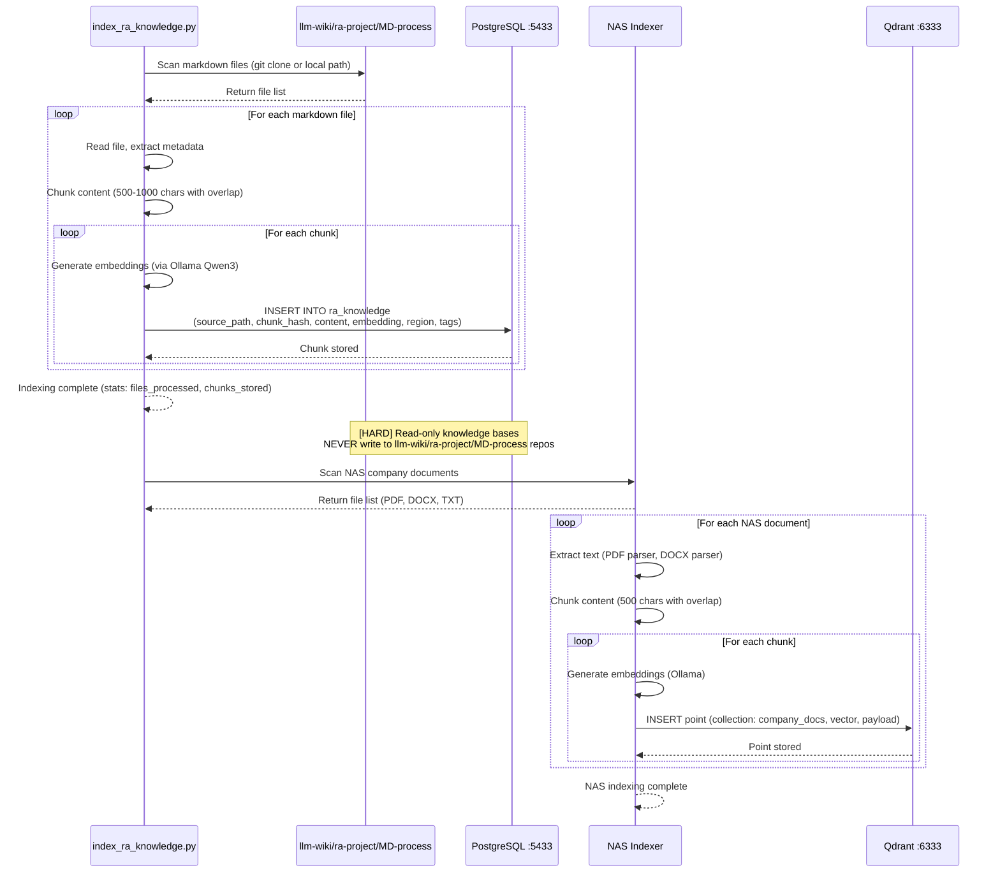
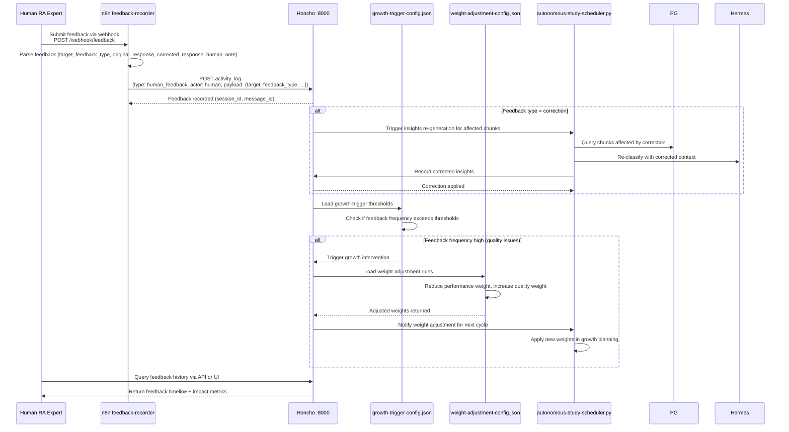

# RA Hermes Multi-Agent - Data Flow & Contracts

## Sequence Diagram: Mail Triage Flow

```mermaid
sequenceDiagram
    participant Gmail as Gmail IMAP
    participant n8n as n8n mail-triage
    participant Hermes as Hermes API :8643
    participant Qdrant as Qdrant :6333
    participant NAS as NAS RAG
    participant GX10 as GX10 Qwen3
    participant Honcho as Honcho :8000
    participant OP as OpenProject
    participant VO as Virtual Office

    Gmail->>n8n: New unread email (poll every minute)
    n8n->>n8n: Parse body, extract original subject/from
    n8n->>n8n: Detect regulatory region (US/EU/KR keywords)
    n8n->>n8n: Route to green (single region) or yellow (multi/no region)
    
    alt Green route (single region)
        n8n->>Hermes: POST /v1/chat/completions<br/>{model: ra_us, messages, subject}
        Hermes->>Qdrant: Layer 1 RAG search (subject-based query)
        Qdrant-->>NAS: Qdrant queries NAS docs
        NAS-->>Qdrant: Returns top 5 relevant chunks
        Qdrant-->>Hermes: RAG results (source_file, score, text)
        
        Hermes->>Hermes: Layer 4 knowledge fetch (llm-wiki, openFDA, law.go.kr)
        Hermes->>GX10: Invoke hermes binary with context<br/>hermes -p ra-us -z <context> --skills ra-expert
        GX10-->>Hermes: RA classification result
        
        alt Result parse successful
            Hermes-->>n8n: {wp_comment: {wp_title, summary, recommendation, confidence, matched_wp_id, ...}}
        else Error/timeout
            Hermes-->>n8n: Error fallback JSON (low confidence, hermes_failed flag)
        end
        
        n8n->>n8n: Parse wp_comment, validate confidence
        n8n->>n8n: Check YELLOW_CONFIDENCE_THRESHOLD (default 0.75)
        
        alt Confidence >= threshold (Green gate pass)
            n8n->>Honcho: POST activity_log<br/>{type: matched, actor: ra_us, payload: {wp, confidence, existing}}
            n8n->>OP: POST comment to OpenProject WP
            Honcho->>VO: Activity log broadcast (SSE)
            VO-->>Human: Real-time pixel-art update
        else Confidence < threshold (Yellow gate fail)
            n8n->>Honcho: POST activity_log<br/>{type: yellow_route, actor: system, payload: {reason: low_confidence}}
            n8n->>n8n: Route to human review queue
            Honcho->>VO: Yellow event logged
        end
        
        else Yellow route (multi-region or no region detected)
            n8n->>Honcho: POST activity_log<br/>{type: yellow_route, actor: system, payload: {reason: multi_region}}
            n8n->>n8n: Route to human review queue
        end
    end
```

## Sequence Diagram: Infra Vote → Bridge Flow



## Sequence Diagram: Autonomous Study/Growth Loop



## Sequence Diagram: Knowledge Indexing Flow



## Sequence Diagram: Human Feedback Loop



## Data Contracts

### RA Analysis Result JSON

**CLAUDE.md Declared Schema (FROZEN contract):**
```json
{
  "actor": "ra_us|ra_eu|ra_kr",
  "wp": "WP-123|null",
  "match": "existing|new",
  "confidence": 0.0-1.0,
  "region": "US|EU|KR",
  "comment": "Brief analysis comment",
  "transition_proposed": "리뷰중|null"
}
```

**ACTUAL Output from hermes-api-server.py parse_wp_comment():**
```json
{
  "wp_comment": {
    "email_type": "완료통보|액션필요|정보수신",
    "wp_title": "String (Korean)",
    "summary": "String (Korean)",
    "recommendation": "String (Korean)",
    "confidence": 0.9,
    "deadline": null|ISO8601-date,
    "product": "String|null",
    "org": "String|null",
    "matched_wp_id": 123|null,
    "source_docs": [
      {"file": "/path/to/doc.pdf", "score": 0.85, "excerpt": "..."},
      {"file": "/path/to/doc2.pdf", "score": 0.72, "excerpt": "..."}
    ],
    "market_analysis": {
      "mfds": "String|null",
      "ce_mdr": "String|null",
      "fda": "String|null"
    },
    "flags": ["flag1", "flag2"]
  }
}
```

> **⚠️ DRIFT WARNING:** The actual output is a **nested structure** with `wp_comment` wrapper. The n8n workflow (`mail-triage.json`) handles **both formats**:
> 1. Hermes format (nested with `wp_comment`)
> 2. Flat format (direct `actor`, `wp`, `match`, `confidence`, `region`, `comment`)
>
> The workflow's `parse-ra-response` node extracts from `parsed.wp_comment` if present, otherwise treats the response as flat format.

**Routing Rules (Yellow Gate):**
- `confidence < YELLOW_CONFIDENCE_THRESHOLD` → Yellow route (human review)
- Invalid/missing required fields → Yellow route
- Ambiguous routing (multi-region) → Yellow route
- Existing WP closed/done state → Yellow route
- OpenProject lookup failure → Yellow route

### Activity Log Format (Honcho Output → Virtual Office Input)

**FROZEN Contract:**
```json
{
  "ts": "ISO8601-timestamp",
  "type": "mail_received|matched|comment_added|transition_proposed|yellow_route|wp_closed|vote_cast|vote_result|score_given|study_insight|session_complete",
  "actor": "ra_us|ra_eu|ra_kr|op_manager|n8n_manager|infra_*|human|system",
  "target": "ra_us|ra_eu|ra_kr|null",
  "payload": {
    "wp": "WP-123",
    "confidence": 0.91,
    "existing": true,
    "note": "진행현황 반영",
    "to": "리뷰중",
    "reason": "low_confidence|multi_region|parse_error",
    "region": "US|EU|KR",
    "subject": "...",
    "result": "approved|rejected|pending",
    "vote": "approve|reject|abstain",
    "topic": "...",
    "target": "Mike 매칭",
    "score": 3
  }
}
```

**Virtual Office Mapping:**
- `activity_log` type messages in Honcho → `adaptHonchoMessage()` → Virtual Office events
- Actor IDs: `ra_us`, `ra_eu`, `ra_kr` (underscore, Honcho peer IDs)
- Character mapping: Mike=`ra_us`, Theo=`ra_eu`, Sam=`ra_kr`

### Growth Metrics Schema

**FROZEN Contract:**
```json
{
  "generated_at": "ISO8601-timestamp",
  "window_start": "ISO8601-date",
  "window_end": "ISO8601-date",
  "metrics": {
    "correction_rate": 0.15,
    "first_pass_match_accuracy": 0.82,
    "confidence_calibration": 0.08,
    "warmstart_lift": 0.35,
    "escalation_precision": 0.91,
    "autonomous_study_sessions": 3,
    "study_insights_count": 42,
    "absence_pattern_signals": []
  },
  "agent_breakdown": {
    "ra_us": {...},
    "ra_eu": {...},
    "ra_kr": {...}
  },
  "readiness": {
    "coverage_score": 0.85,
    "depth_score": 0.73,
    "trend_score": 0.67,
    "overall_verdict": "ready|caution|not_ready"
  }
}
```

**Metric Definitions:**
- `correction_rate` = (human_corrections / total_autonomous_decisions)
- `first_pass_match_accuracy` = (correct_first_pass_matches / total_first_pass_attempts)
- `confidence_calibration` = average(|predicted_confidence - actual_outcome|)
- `warmstart_lift` = (autonomous_accuracy - cold_start_baseline)
- `escalation_precision` = (correct_escalations / total_escalations)
- `autonomous_study_sessions` = count of completed study sessions per agent
- `study_insights_count` = total insights generated across all sessions
- `absence_pattern_signals` = list of gaps in knowledge coverage

## Gate Rules Reference

**Matching + Comment (Green Gate):**
- Autonomous for:
  - Single clear region detected (US/EU/KR)
  - Confidence >= YELLOW_CONFIDENCE_THRESHOLD
  - Valid wp_comment structure
  - Existing WP in active state
- Honcho records: `type=matched` or `type=comment_added`

**Status Transition (escalates with maturity):**
- Initial: Escalates to human for review
- As learning matures: Autonomous for low-risk transitions
- **Close / Reopen WP** = Human-only permanently (GATE-3)

**n8n Workflow Changes:**
- Report first, then proceed (no silent modifications)
- Requires human approval for destructive changes

**Human-Only Actions (permanent):**
- WP close/reopen
- Destructive infra actions (container deletion, DB reset)
- n8n workflow structural changes (require approval)

**Configurable Thresholds:**
- `YELLOW_CONFIDENCE_THRESHOLD` (env var, default 0.75)
- Vote quorum, weights, thresholds (vote-rules.json)
- Bridge relay conditions (bridge-config.json)
- Growth trigger thresholds (growth-trigger-config.json)
