# RA Hermes Multi-Agent - Dependency Graph

## Inter-System Dependency Graph

```mermaid
graph TD
    subgraph "External Inputs"
        Gmail[Gmail IMAP]
        NAS[NAS Documents]
        Human[Human Feedback]
    end
    
    subgraph "Business Layer"
        n8n[n8n Workflows]
        Hermes[Hermes API Server :8643]
        Virtual[Virtual Office :3001]
    end
    
    subgraph "Growth Layer"
        Study[autonomous-study-scheduler.py]
        Daily[daily-growth-runner.py]
        Metrics[growth-metrics.py]
    end
    
    subgraph "Knowledge Layer"
        Qdrant[Qdrant :6333]
        Indexer[index_ra_knowledge.py]
        NASIndex[nas_indexer_v2.py]
        KFetch[knowledge_fetch.py]
    end
    
    subgraph "Infrastructure Layer"
        Vote[vote-aggregator.js]
        Bridge[bridge-config.json]
    end
    
    subgraph "Core Platform"
        Honcho[Honcho :8000]
        PG[PostgreSQL :5433]
        Redis[Redis :6379]
    end
    
    subgraph "Inference Backend"
        GX10[GX10 Qwen3 :11434]
    end
    
    subgraph "External Systems"
        OP[OpenProject API]
    end
    
    Gmail -->|unread email| n8n
    Human -->|feedback| n8n
    n8n -->|RA classify| Hermes
    Hermes -->|Layer1 RAG| Qdrant
    Hermes -->|Layer4 fetch| KFetch
    Hermes -->|LLM inference| GX10
    Hermes -->|record activity| Honcho
    n8n -->|WP operations| OP
    n8n -->|infra votes| Vote
    Vote -->|broadcast results| n8n
    n8n -->|relay to work| Bridge
    
    Study -->|read chunks| PG
    Study -->|classify chunks| Hermes
    Study -->|record insights| Honcho
    Daily -->|plan growth| PG
    Daily -->|generate cases| Hermes
    Daily -->|record growth| Honcho
    Metrics -->|query sessions| Honcho
    Metrics -->|analyze quality| PG
    
    Indexer -->|read repos| NAS
    Indexer -->|write pgvector| PG
    NASIndex -->|read NAS| NAS
    NASIndex -->|write Qdrant| Qdrant
    
    Honcho -->|store sessions| PG
    Honcho -->|cache| Redis
    Virtual -->|read logs| Honcho
```

## Python Local Imports

**Verified: NO local Python imports**

Explore agent found that NO Python scripts in `scripts/` import other local Python modules. All imports are from standard library or external packages (psycopg2, requests, etc.).

**External Libs by Cluster:**

**Growth & Learning:**
- `psycopg2`, `psycopg2.extras` - PostgreSQL/pgvector
- `requests` - HTTP clients (Honcho, Hermes APIs)
- `subprocess`, `json`, `logging`, `datetime` - Standard library

**Knowledge Indexing:**
- `psycopg2`, `psycopg2.extras` - PostgreSQL
- `git` - Repo cloning (index_github_repos.py)
- `requests` - HTTP APIs (Qdrant, external sources)

**Operations Tools:**
- `json`, `pathlib`, `re` - Standard library
- `email` - Email parsing (extract_mail_qa.py)

## Node.js Local Imports

**voting/vote-aggregator.js:**
- Built-in only: `fs`, `path`
- No external deps

**virtual-office/virtual-office-honcho-adapter.js:**
- Built-in only: `http`, `https`, `fs`, `path`, `url`
- No external deps

**e2e/*.spec.js:**
- External: `@playwright/test`
- Built-in: `path`, `url`

## External Libs by Cluster

**Python 3.13 Scripts:**
- `psycopg2` (postgresql adapter)
- `requests` (HTTP client)
- `subprocess` (hermes binary invocation)
- Standard library: `json`, `logging`, `datetime`, `pathlib`, `re`, `argparse`, `dataclasses`

**n8n Workflows:**
- Node.js built-in (no package.json dependencies)
- n8n platform provides runtime

**E2E Tests:**
- `@playwright/test@^1.60.0`

## n8n → External Calls

**mail-triage.json:**
- Gmail IMAP OAuth (`n8n-nodes-base.gmailTrigger`)
- Hermes API `POST /v1/chat/completions` (:8643)
- Honcho API `POST /v3/workspaces/{ws}/sessions` (:8000)
- OpenProject REST API (WP comment creation)

**infra-vote-broadcast.json:**
- Infra agents (H11 endpoints on GX10/T3610/RPi)
- `require('./vote-aggregator.js)` (local Node.js module)

**feedback-recorder.json:**
- Honcho API `POST /v3/workspaces/{ws}/sessions` (:8000)

**wp-close-recorder.json:**
- Honcho API `POST /v3/workspaces/{ws}/sessions` (:8000)

## systemd → Script → Python Chains

**ra-growth-metrics.timer (daily 02:00)**
  → ra-growth-metrics.service
  → `scripts/growth-metrics-cron.sh`
  → `python3 scripts/growth-metrics.py`
  → [Honcho API :8000, PostgreSQL :5433]

**hermes-auto-growth.timer**
  → hermes-auto-growth.service
  → `scripts/auto-growth-runner.sh`
  → `python3 scripts/pre-auto-growth-loop.py` + `python3 scripts/non-email-growth-loop.py`
  → [Hermes API :8643, Honcho API :8000, PostgreSQL :5433]

**hermes-study.timer**
  → hermes-study.service
  → `python3 scripts/autonomous-study-scheduler.py --mode delta`
  → [Hermes API :8643, PostgreSQL :5433]

**hermes-daily-monitoring.timer**
  → hermes-daily-monitoring.service
  → `scripts/daily-monitoring.sh`
  → Health checks (Honcho :8000, PostgreSQL :5433, Redis :6379)

## High-Coupling Hotspots

**Tight Coupling (Expected):**
- Hermes API ↔ Honcho (session recording)
- n8n ↔ Hermes API (RA classification)
- n8n ↔ OpenProject (WP operations)
- Growth scripts ↔ PostgreSQL (ra_knowledge queries)
- Study scheduler ↔ Hermes API (chunk classification)

**Loose Coupling (By Design):**
- Virtual Office ↔ Honcho (read-only, SSE/polling)
- Vote Aggregator ↔ n8n (config-driven, no hard deps)
- Bridge Config ↔ n8n (intentionally empty, [IF] principle)

**No Circular Dependencies Detected:**

All dependency flows are unidirectional:
- External → Business → Growth → Knowledge → Platform
- No upstream component depends on downstream component

## Config-Driven Coupling

**[IF] Components (rules loaded from JSON):**
- `vote-aggregator.js` ← `voting/config/vote-rules.json`
- `bridge-config.json` (empty initially, populated from ops)
- `feedback/config/growth-trigger-config.json` (empty initially)
- `feedback/config/weight-adjustment-config.json`

These components have ZERO hardcoded business rules. All behavior is driven by JSON config files that operations teams can tune without code changes.
