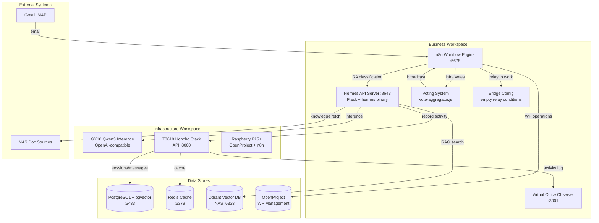

# RA Hermes Multi-Agent - Architecture Overview

## System Purpose

RA Hermes Multi-Agent is a learning multi-agent system for medical device regulatory affairs (RA). It automates email triage and work package management through AI agents that grow smarter through human feedback. The system prioritizes accuracy and reliability over speed—agents assist human RA experts but never replace them. When uncertain, the system escalates to human review rather than making low-confidence regulatory judgments.

## Component Architecture

## Module Summary

| Component | Responsibility | Language | Key Entry Points |
|-----------|---------------|----------|------------------|
| **Hermes API Server** | OpenAI-compatible RA classification bridge | Python 3.13 / Flask | `/v1/chat/completions`, `/v1/knowledge/fetch` |
| **n8n Workflows** | Email triage, WP operations, infra coordination | Node.js / n8n JSON | `mail-triage.json`, `infra-vote-broadcast.json` |
| **Virtual Office** | Read-only activity observer (pixel-art UI) | Node.js / Express | `/api/events` endpoint |
| **Voting System** | Infra decision aggregation (config-driven) | Node.js (ES2024+) | `vote-aggregator.js` |
| **Bridge Config** | Human relay conditions (intentionally empty) | JSON | `bridge-config.json` |
| **Growth Loop** | Autonomous study, daily growth, metrics | Python 3.13 | `autonomous-study-scheduler.py`, `daily-growth-runner.py` |
| **Knowledge Indexing** | pgvector population from NAS/repos | Python 3.13 | `index_ra_knowledge.py`, `nas_indexer_v2.py` |
| **Honcho Stack** | Session management, memory, deriver | Python 3.15 / FastAPI | `:8000` API |
| **E2E Tests** | Playwright validation of dashboards | JavaScript / Playwright | `growth-dashboard.spec.js` |

## Tech Stack

**Backend Core:**
- Python 3.13+ (Flask, psycopg2, requests)
- Node.js 22 LTS (Express, n8n workflows)
- PostgreSQL 15 with pgvector extension
- Redis 7 (cache layer)

**AI/ML:**
- Hermes Agent v0.15.1 (hermes binary)
- GX10 Qwen3 inference backend (OpenAI-compatible API)
- Qdrant vector database (NAS RAG)

**Infrastructure:**
- Docker Compose (Honcho stack, virtual office)
- systemd timers (daily growth metrics at 02:00)
- Playwright (E2E testing)

**Integration:**
- OpenProject REST API (WP management)
- Gmail IMAP OAuth (email source)
- HTTP/JSON (all inter-service communication)

## Critical Ports

| Service | Port | Protocol | Purpose |
|---------|------|----------|---------|
| Hermes API Server | 8643 | HTTP | RA classification endpoint |
| Honcho API | 8000 | HTTP | Session/memory management |
| PostgreSQL | 5433 | TCP | pgvector + Honcho data |
| Redis | 6379 | TCP | Cache layer |
| n8n | 5678 | HTTP | Workflow engine UI |
| Virtual Office (container) | 3000 | HTTP | Adapter server |
| Virtual Office (host) | 3001 | HTTP | Exposed to user |
| Qdrant (NAS) | 6333 | HTTP | Vector DB for RAG |

> **⚠️ Drift Warning:** CLAUDE.md states virtual-office runs on `:3001`. The adapter container runs on `:3000` internally, but Docker Compose maps it to `:3001` on the host. Both ports are correct—`:3000` is container-internal, `:3001` is host-exposed.

## Key Environment Variables

| Variable | Default | Purpose |
|----------|---------|---------|
| `HONCHO_URL` | `http://localhost:8000` | Honcho API endpoint |
| `HERMES_API_URL` | `http://localhost:8643` | Hermes API server |
| `API_SERVER_KEY` | (required) | Bearer token for Hermes API |
| `POSTGRES_URL` | (required) | PostgreSQL DSN with pgvector |
| `QDRANT_URL` | `http://localhost:6333` | Qdrant vector DB (NAS) |
| `GX10_URL` | `http://gx10:11434` | Qwen3 inference backend |
| `HONCHO_WS` | `work` | Honcho workspace name |
| `YELLOW_CONFIDENCE_THRESHOLD` | 0.75 | Minimum confidence for auto-routing |
| `STUDY_BATCH_SIZE` | 5 | Chunks per autonomous study session |
| `AUTO_GROWTH_OPERATION_TZ` | `Asia/Seoul` | Growth metrics timezone |
